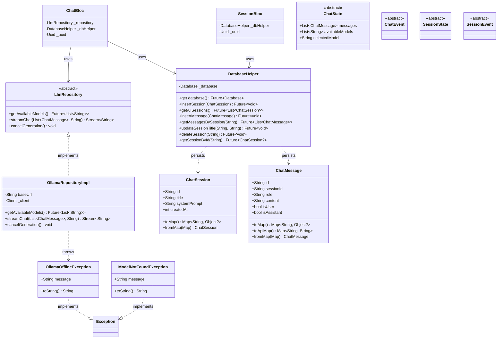

# LocalMind - Desktop Local LLM Chat Client

LocalMind adalah aplikasi *desktop chat client* berbasis Flutter untuk berinteraksi dengan model Large Language Model (LLM) secara lokal (offline) menggunakan **Ollama**. Aplikasi ini dibangun dengan fokus pada privasi, performa, serta struktur *Object-Oriented Programming* (OOP) yang bersih menggunakan pola *Layered Architecture* dan *BLoC (Business Logic Component)* untuk *State Management*.

---

## 🌟 Fitur Utama (MVP)
- **Koneksi LLM Lokal:** Menghubungkan secara otomatis ke layanan Ollama di `localhost:11434`.
- **Pemilihan Model Dinamis:** Mendeteksi dan menampilkan daftar model yang tersedia (sudah di-*pull*) di sistem pengguna.
- **Streaming Response:** Tanggapan AI langsung muncul per-token/kata seperti ChatGPT (tidak perlu menunggu keseluruhan teks selesai).
- **Konteks Percakapan:** Seluruh history pesan dikirim ke AI, sehingga AI bisa mengingat konteks percakapan sebelumnya.
- **Multi-Session Chat:** Mengelola beberapa sesi obrolan (*history*) secara terpisah.
- **Persistensi Data:** Seluruh sesi dan pesan percakapan tersimpan secara permanen di database lokal (SQLite).
- **Konfigurasi System Prompt:** Mendukung pengaturan karakter AI (System Prompt) di setiap kali pembuatan sesi baru.
- **Dukungan Markdown:** *Response* dari AI dirender dalam bentuk *Markdown* yang rapi (mendukung *code-blocks*, *bold*, *italic*, dll).
- **Stop Generation:** Pengguna bisa menghentikan respon AI di tengah jalan.
- **Error Handling:** Penanganan *error* saat Ollama mati, model tidak tersedia, maupun koneksi terputus.

---

## 🛠️ Teknologi & Arsitektur
- **Platform:** Desktop (Windows)
- **Bahasa:** Dart (statically-typed, strict-casts diaktifkan)
- **Framework UI:** Flutter
- **State Management:** BLoC / flutter_bloc + Equatable
- **Database:** SQLite (menggunakan `sqflite_common_ffi`)
- **HTTP Client:** `http` package
- **Markdown:** `flutter_markdown`

Aplikasi ini mengadopsi **Layered Architecture** yang memisahkan:
1. **Presentation Layer (`presentation/`):** Menyimpan *screens* dan *widgets* (UI/UX).
2. **Business Logic Layer (`business_logic/`):** Mengelola *state* dan *event* menggunakan pola BLoC (`ChatBloc` dan `SessionBloc`).
3. **Data Layer (`data/`):** Menyediakan layanan untuk terhubung ke eksternal (API Ollama via `OllamaRepositoryImpl`) dan *local storage* (SQLite via `DatabaseHelper`). Tersedia juga abstraksi dan model.
4. **Core (`core/`):** Definisi custom exception/error yang dipakai di seluruh layer.

---

## 📁 Struktur Folder

```text
lib/
├── main.dart                            # Entry point aplikasi
├── core/
│   └── errors/
│       └── exceptions.dart              # OllamaOfflineException, ModelNotFoundException
├── data/
│   ├── models/
│   │   ├── chat_message.dart            # Model pesan (toMap, toApiMap, fromMap)
│   │   └── chat_session.dart            # Model sesi chat
│   ├── repositories/
│   │   ├── llm_repository.dart          # Abstract class (interface)
│   │   └── ollama_repository_impl.dart  # Implementasi: /api/chat + streaming
│   └── local_db/
│       └── sqlite_helper.dart           # Singleton DatabaseHelper (SQLite)
├── business_logic/
│   ├── chat_bloc/
│   │   ├── chat_bloc.dart               # BLoC: kirim pesan, fetch model, stop
│   │   ├── chat_event.dart              # SendMessage, FetchModels, Stop, LoadHistory
│   │   └── chat_state.dart              # Initial, Loading, Streaming, Success, Error
│   └── session_bloc/
│       ├── session_bloc.dart            # BLoC: CRUD sesi
│       ├── session_event.dart           # Create, Load, Rename, Delete
│       └── session_state.dart           # Initial, Loading, Loaded, Error
└── presentation/
    ├── screens/
    │   └── home_chat_screen.dart        # Layar utama (sidebar + chat area)
    └── widgets/
        ├── chat_bubble.dart             # Widget gelembung pesan + Markdown
        └── sidebar_history.dart         # Widget sidebar riwayat + New Chat
```

---

## 📊 Class Diagram

Berikut adalah arsitektur *Object-Oriented Programming* dari aplikasi menggunakan notasi Mermaid:



---

## 🔧 Penerapan Prinsip OOP

### 1. Encapsulation
- Field pada model (`ChatMessage`, `ChatSession`) bersifat `final` (immutable), hanya diatur melalui constructor.
- `DatabaseHelper` menyembunyikan implementasi database (`_database`, `_initDatabase()`, `_onCreate()`) dengan modifier `private` (`_`).
- `OllamaRepositoryImpl` mengenkapsulasi `_client` HTTP sebagai field private.

### 2. Abstraction
- **`LlmRepository`** — abstract class yang mendefinisikan kontrak tanpa implementasi. Business Logic Layer tidak bergantung pada detail Ollama.
- **`ChatEvent`**, **`ChatState`**, **`SessionEvent`**, **`SessionState`** — abstract class sebagai base class untuk BLoC pattern.

### 3. Inheritance
- `OllamaRepositoryImpl` **implements** `LlmRepository`.
- `OllamaOfflineException`, `ModelNotFoundException` **implements** `Exception`.
- State classes: `ChatInitial`, `ChatLoading`, `ChatStreaming`, `ChatSuccess`, `ChatError` → **extends** `ChatState`.
- Event classes: `SendMessageEvent`, `StopGenerationEvent`, `LoadChatHistory`, `FetchModelsEvent` → **extends** `ChatEvent`.

### 4. Polymorphism
- `ChatBloc` menerima parameter bertipe `LlmRepository` (abstract), bukan `OllamaRepositoryImpl` (konkret). Implementasi bisa diganti tanpa mengubah kode BLoC.
- Method `toString()` di-override pada custom exception classes.
- BLoC `on<T>` handler memproses berbagai event secara polimorfik.

---

## 🏗️ Design Pattern

| Pattern | Penerapan |
|---------|-----------|
| **BLoC** | State management via `ChatBloc` dan `SessionBloc` |
| **Repository** | `LlmRepository` (abstraksi) + `OllamaRepositoryImpl` (implementasi) |
| **Singleton** | `DatabaseHelper` via factory constructor + `_instance` static |
| **Factory** | `fromMap()` factory constructor pada `ChatMessage` dan `ChatSession` |
| **Observer** | `BlocBuilder` di UI mengamati perubahan state dari BLoC |

---

## 🚀 Panduan Instalasi dan Menjalankan

### Persyaratan Sistem
1. Install [Flutter SDK](https://docs.flutter.dev/get-started/install). Pastikan support *Windows Desktop* menyala (`flutter config --enable-windows-desktop`).
2. Install [Ollama](https://ollama.com).
3. Unduh (*pull*) setidaknya satu model di Ollama. Contoh untuk komputer ringan:
   ```bash
   ollama pull qwen2.5:0.5b
   ```

### Cara Menjalankan
1. Pastikan layanan Ollama sudah berjalan di latar belakang:
   ```bash
   ollama serve
   ```
2. *Clone* repositori ini, lalu masuk ke foldernya lewat terminal.
3. Unduh seluruh dependensi:
   ```bash
   flutter pub get
   ```
4. Jalankan aplikasi desktop Windows:
   ```bash
   flutter run -d windows
   ```

---

## ✅ Manual Testing Checklist

Gunakan tabel pengujian di bawah ini untuk memverifikasi fitur aplikasi secara manual.

| ID | Fitur | Langkah Pengujian | Hasil yang Diharapkan | Status |
|----|-------|-------------------|-----------------------|--------|
| **TC-01** | Koneksi & Cek Model | Buka aplikasi, pastikan Ollama berjalan di latar belakang. | Dropdown model di atas layar berhasil menampilkan list model (misal: `qwen2.5:0.5b`). | [ ] |
| **TC-02** | *New Chat* & System Prompt | Klik tombol "New Chat" di *sidebar*, masukkan "System Prompt" (misal: *"Jawab dengan bahasa Sunda"*). | Sesi baru tercipta dan pindah ke ruangan *chat* kosong. | [ ] |
| **TC-03** | Auto-Title | Kirim pesan pertama panjang di ruangan sesi baru. | *Title* di sidebar langsung ter-update (terpotong rapi dengan elipsis/...). | [ ] |
| **TC-04** | Streaming Text | Tunggu proses respons AI setelah menekan tombol "Kirim". | Teks balasan AI muncul sedikit demi sedikit secara dinamis (*streaming*). | [ ] |
| **TC-05** | Konteks Percakapan | Kirim pesan pertama: "Siapa nama presiden pertama Indonesia?". Lalu kirim pesan kedua: "Kapan dia lahir?". | AI menjawab sesuai konteks (tahu bahwa "dia" merujuk ke Soekarno dari pesan sebelumnya). | [ ] |
| **TC-06** | Format Markdown | Beri prompt ke AI: "Buatkan contoh kode Hello World dengan Python". | Respons AI yang berupa baris kode dirender dengan *code block* Markdown yang rapi. | [ ] |
| **TC-07** | Stop Generation | Tekan tombol kirim ke AI, lalu di tengah-tengah ia sedang mengetik balasan, tekan ikon tombol "Stop" (berwarna merah). | AI berhenti seketika memberikan teks, sisa chat tidak diteruskan. UI kembali ke mode *ready*. | [ ] |
| **TC-08** | Persistensi State (SQLite) | Buat sesi, lakukan tanya jawab. Lalu tutup (matikan) keseluruhan aplikasi dan buka lagi. | Obrolan yang telah berlalu masih tertera lengkap di *sidebar*. Ketika diklik, isinya dapat dimuat ulang (*load*). | [ ] |
| **TC-09** | Hapus Sesi (Delete) | Tekan ikon 'Sampah' di daftar *chat sidebar*. | Sesi obrolan menghilang dari layar *sidebar*. | [ ] |
| **TC-10** | Error Handling (Ollama Mati) | Matikan paksa `ollama serve`, lalu buka aplikasi/kirim pesan. | Aplikasi tidak mengalami *crash* mendadak. Muncul *warning* atau *text* merah di UI (koneksi terputus/gagal memuat model). | [ ] |
